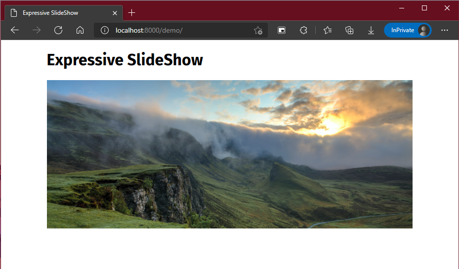
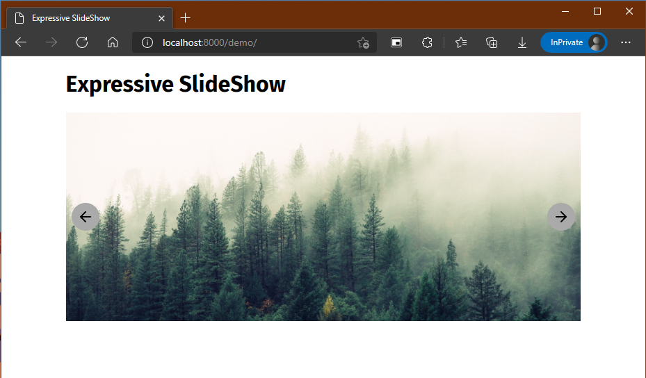
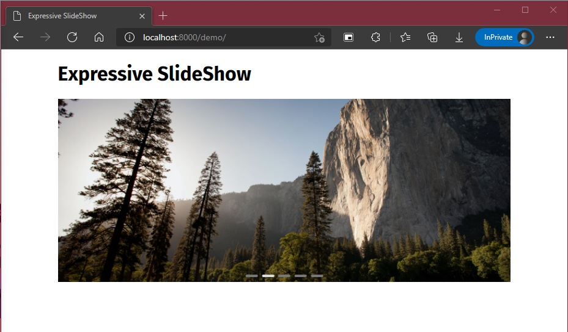
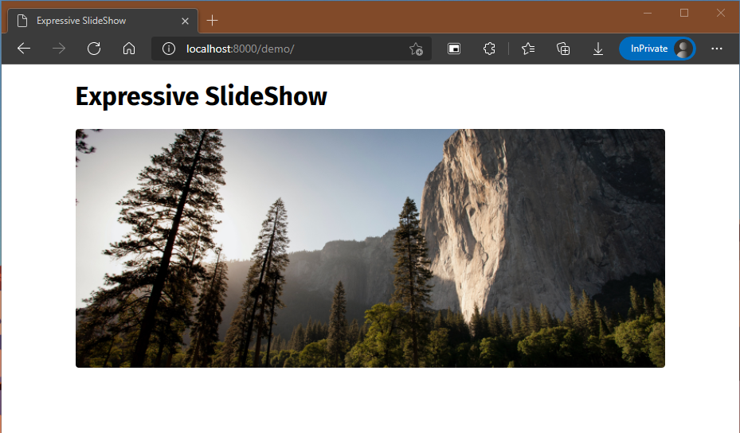
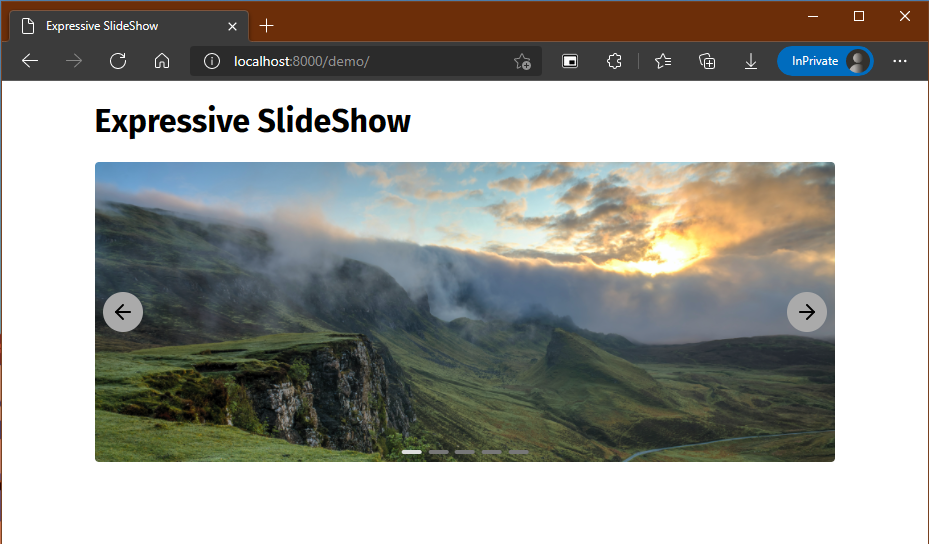

# \<slide-show>

## Installation

### As NPM package

```bash
npm install --save @expressive-wc/slide-show
```

```js
import SlideShow from '@expressive-wc/slide-show/slide-show.js'
```

### As html script

<!-- TODO: Make GitHub release and serve file -->
<!-- #### Local file

- [Download latest release]()

```html
<script type="module" src="<path-to-file>"></script>
``` -->

#### unpkg

```html
<script type="module" src="https://unpkg.com/@expressive-wc/slide-show@0.0.7/dist/slide-show_0.0.7.min.js" integrity="sha384-x7wnLEKARE0k4q1cttqoD8Uj6X2NVEB/1rT7d0UrY8MsyphbxngGS9Bs31F1Phwj" crossorigin="anonymous"></script>
```

#### jsdelivr

```html
<script src="https://cdn.jsdelivr.net/npm/@expressive-wc/slide-show@0.0.7/dist/slide-show_0.0.7.min.js" integrity="sha256-eBq0lZtKEakRPQDWq0tVl4t3MrCSXnyqfyHsKGA9EYE=" crossorigin="anonymous"></script>
```

## Usage

First, you'll need to set up the element and add some images to it. For the element, you can set an `interval` (in ms) that will be used to automatically transition slides.

For the images, besides the `src` you **must** set the `index`, which will be the order in which they'll transition.

```html
<slide-show id="my-slide-show" interval="3000">
  
  
  
  
  <!-- ... -->
</slide-show>
```

It is important that you also give the element a height style and make the images so that they don't display (don't worry, the component will make them show when it loads). These settings will prevent layout jumps in your page.

```css
slide-show#my-slide-show {
  height: 300px;
}

slide-show#my-slide-show > img {
  display: none;
}
```



### Navigation Buttons

You can set css variables to customize the appearance of navigation buttons, giving them a background color and (optionally) background images.

```css
slide-show#my-slide-show {
  --slide-show-nav-button-bg: #AAAAAA;
  --slide-show-previous-icon: url(arrow-left.svg);
  --slide-show-next-icon: url(arrow-right.svg)
}
```



### Slide buttons

Similarly, you can style the slides button that will appear at the bottom and allow users to switch to a specific image.

```css
slide-show#my-slide-show {
  --slide-show-select-button-bg: #777777;
  --slide-show-active-button-bg: #DDDDDD;
}
```



### Border radius

Provide a border radius to the images.

```css
slide-show#my-slide-show {
  --slide-show-img-border-radius: 0.25rem;
}
```



### Final result


